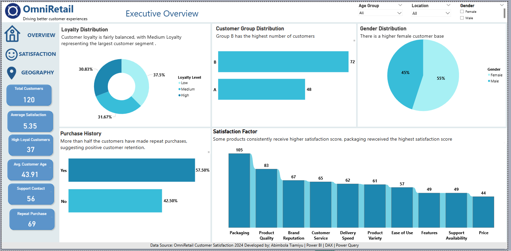
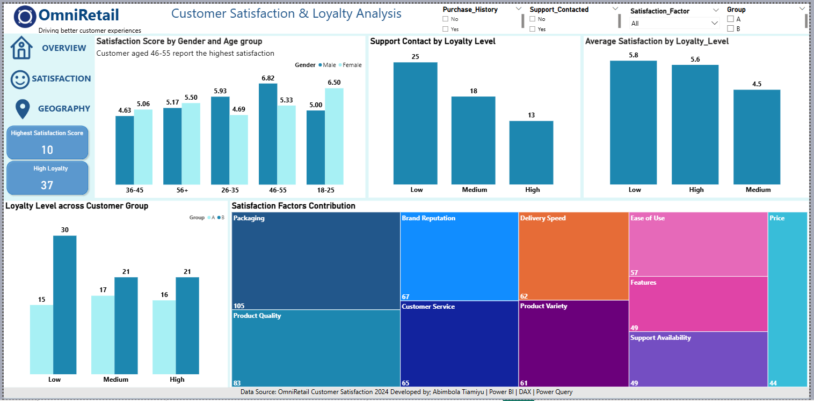
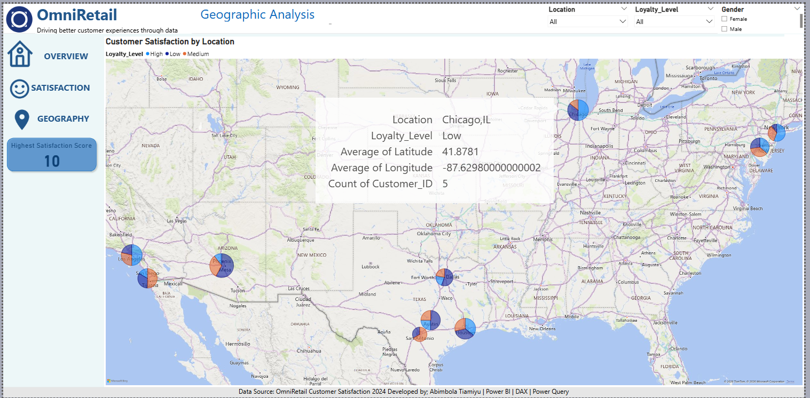

# Customer-Satisfaction-Analysis
### Power BI | Data Analytics | Customer Experience
An interactive Power BI dashboard designed to analyze customer satisfaction, loyalty, repeat purchase behavior, customer support interactions, and geographic performance.

> **Project Type:** Customer Experience & Retention Analytics  
> **Role:** Data Analyst | Power BI Developer   
> **Focus:** Customer Satisfaction | Loyalty | Retention | Support | Geographic Analysis

### Business Problem
OmniRetail wants to better understand its customers and identify the factors influencing satisfaction, loyalty, repeat purchases, and customer support interactions.

### Project Objectives
- Analyze overall customer satisfaction
- Identify key satisfaction drivers
- Understand customer loyalty patterns
- Analyze repeat purchase behavior
- Examine customer support interactions
- Compare customer performance across locations
  
### Tools Used 
- **Power BI** – Dashboard development and data visualization
- **Power Query** – Data cleaning and transformation
- **DAX** – Measures and calculations
- **Excel** – Data source and preparation
  
### Dashboard Pages
#### 1. Executive Overview
Provides a high-level view of customer demographics, loyalty, satisfaction, and purchasing behavior.
#### 2. Customer Satisfaction, Support & Loyalty
Explores satisfaction factors, loyalty levels, repeat purchases, and customer support interactions.
#### 3. Geographic Analysis
Examines customer satisfaction and loyalty across different locations.

### Dashboard Preview
####  Executive Overview

Customer Satisfaction, Support & Loyalty

Geographic Analysis

### Key Performance Indicators
| KPI | Result |
|---|---:|
| Average Satisfaction | **5.35 / 10** |
| Repeat Purchase Customers | **69** |
| High Loyalty Customers | **37** |
| Customer Support Contacts | **See Dashboard** |
| Geographic Satisfaction | **See Dashboard** |

### Results / Findings
- Customer satisfaction is moderate, indicating opportunities to improve the overall customer experience.
- More than half of customers are repeat purchasers, suggesting relatively positive customer retention.
- High-loyalty customers represent a smaller segment of the customer base.
- Satisfaction and loyalty vary across customer groups and geographic locations.
- Product-related factors are important contributors to customer satisfaction.

### Challenges
- Moderate overall satisfaction.
- Uneven loyalty across customer segments.
- Differences in satisfaction across locations.
- Difficulty identifying a single strategy that works for every customer group.

### Recommendations
- Customer satisfaction is moderate, indicating opportunities to improve the overall customer experience.
- More than half of customers are repeat purchasers, suggesting relatively positive customer retention.
- High-loyalty customers represent a smaller segment of the customer base.
- Satisfaction and loyalty vary across customer groups and geographic locations.
- Product-related factors are important contributors to customer satisfaction.
### Project Files

- **Power BI Dashboard:** `Customer Satisfaction_Project.pbix`
- **Dashboard Screenshots:** `screenshots`
